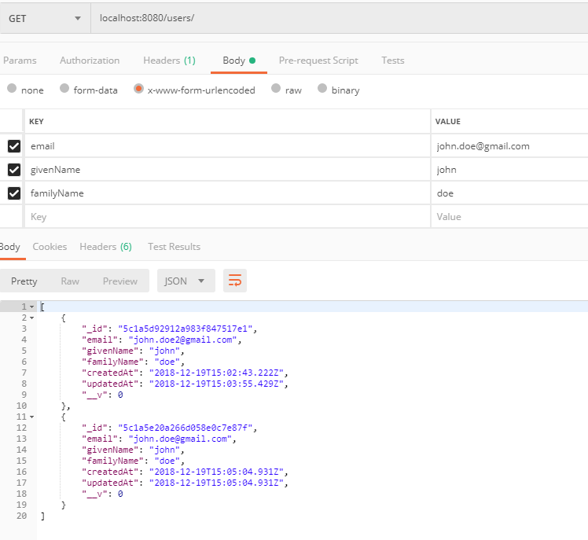
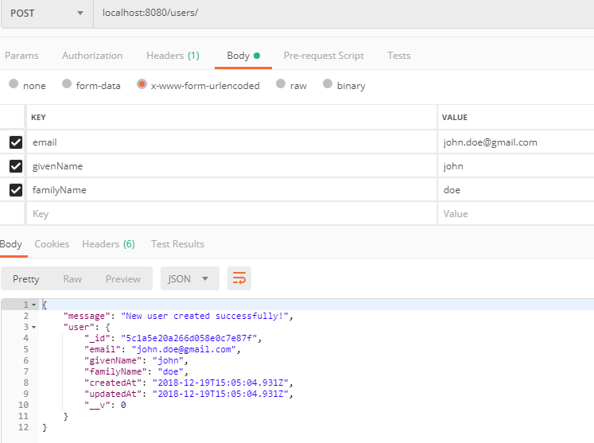
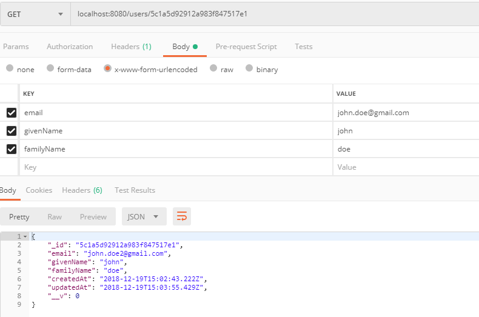
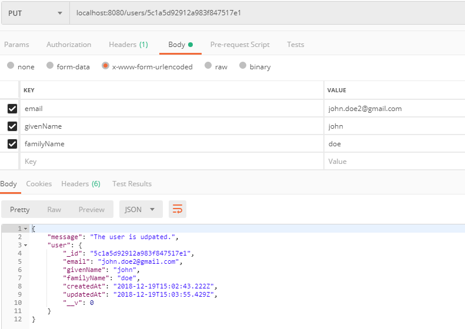
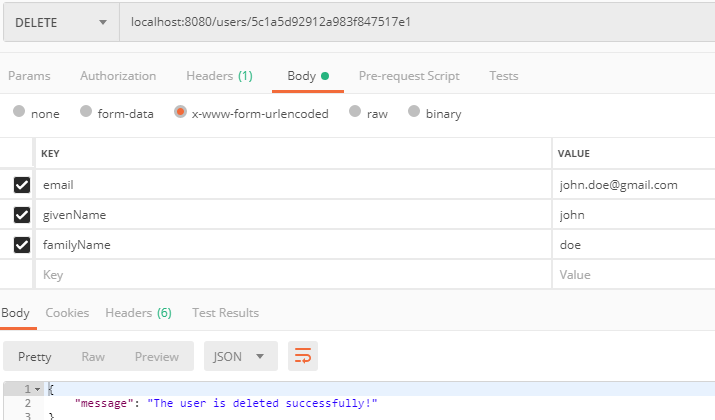

# CRUD-nodejs

Demo APP
========

- start with typing `npm install` and then `npm start`

Prerequisite:
=============
- Node.js and mongoDB installed
- POSTMAN for making fast HTTP requests to the API.

Testing:
========
 - type `npm run test` (to run the included tests)
 or/and
 - use POSTMAN with the following queries after you have saterted your server:
    * http://localhost:8080/ -> to get the welcome message (GET method)
    * http://localhost:8080/users/ -> to get all the users (if any) (GET method)
    * http://localhost:8080/users/ -> to post a new user with the data in the body (e-mail field is mandatory and should be unique) (POST method)
    * http://localhost:8080/users/`id` -> to get specific user (GET method)
    * http://localhost:8080/users/`id` -> to update specific user (PUT method)
    * http://localhost:8080/users/`id` -> to delete specific user (DELETE method)

EXAMPLES:
=========

